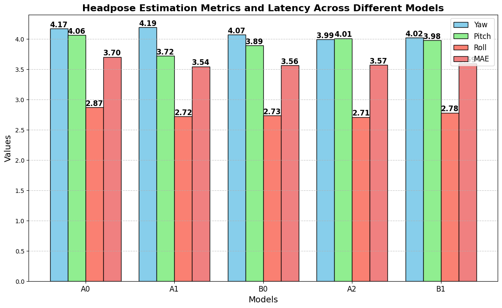
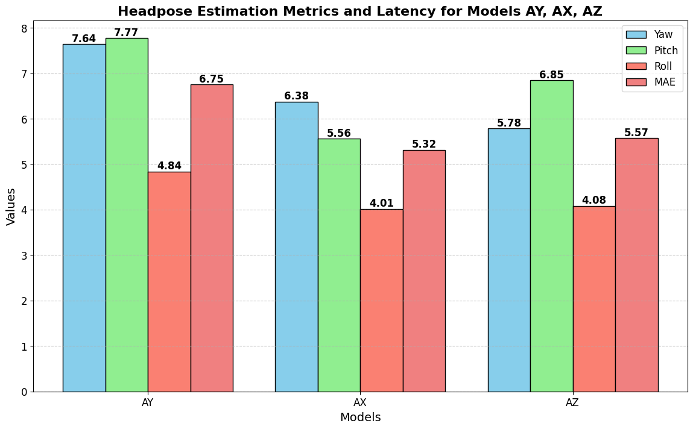
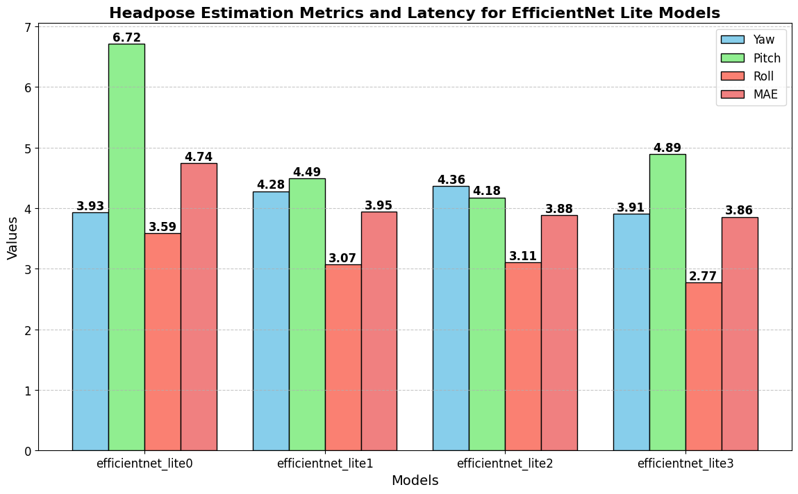

# Training pipeline for Headpose models
## Dependencies to install
1. cuda and cudnn installed on system
2. pytorch with gpu support
3. torchvision
4. tqdm
5. tensorboard 
6. numpy
7. pandas
## How to run
1. first install the package in requirements.txt file preferably in an isolated environment 
```console
pip install -r requirements.txt
```

2. perform dataset preprocessing steps and save the `file.pkl` in `./Datasets/300W-lp/`in the root of the 300W-lp dataset as well as the BIWI dataset final file `BIWI_done.npz` in `./Datasets/BIWI`

3. second get the corresponding variants from

- <a href="https://drive.google.com/drive/folders/1Avome4KvNp0Lqh2QwhXO6L5URQjzCjUq">RepVGG models</a> 
- <a href="https://drive.google.com/drive/folders/1FmEwGVxDZ4qC5cEH0PYaY_98LEDz9WhP?usp=drive_link">efficientnet lite models</a> 

### Train RepVGG B1G2
```console

python TrainRepVGGB1g2.py
```
### Train RepVGG variants A0-B1
```console

python TrainRepVGGA0-B1.py
```
### Train Custom RepVGG variants AX-AY-AZ
```console

python TrainRepVGGspecial.py
```
### Train EfficientNet Lite variants 0-3
```console

python TrainRepVGGspecial.py
```

## Explanation for the main training python module
This Python script trains a neural network model (SixDRepNet) for head pose estimation using different backbone architectures (e.g., RepVGG) on two datasets: 300W-LP and BIWI. Here's a brief breakdown:

1. Imports necessary libraries and modules including PyTorch, NumPy, and custom-defined modules.
2. Defines a custom loss function called GeodesicLoss, which calculates the geodesic distance between two rotation matrices.
3. Defines the main function, which orchestrates the training process.
4. Loads pretrained backbone models for different architectures.
5. Prepares datasets for training and testing, including data augmentation and normalization.
6. Sets up training parameters such as batch size, learning rate, and number of epochs.
7. Trains the model for the specified number of epochs, evaluating performance on the validation dataset after each epoch.
8. Computes mean absolute errors (MAE) for yaw, pitch, and roll angles between predicted and ground truth poses.
9. Selects the best model based on the lowest MAE.
10. Saves the best model and its performance metrics.
11. Closes the TensorBoard writer and prints the results.

## Custom Datasets found in Dataset.py

The notebook includes custom dataset classes for handling image data and corresponding head pose annotations. These datasets are essential for training and evaluating the head pose estimation models.

### pose_eff_dataset

This class is designed to handle the 300W-LP dataset with images and their respective head pose annotations. It performs data augmentation and preprocessing steps such as image cropping, flipping, and blurring.

- **Initialization**: 
  - `data_dir`: Directory where the images are stored.
  - `data`: A dictionary containing image file paths and head pose annotations (`yaw`, `pitch`, `roll`, `x_min`, `y_min`, `x_max`, `y_max`).
  - `transform`: Optional transformations to be applied to the images.
- **Methods**:
  - `__getitem__(index)`: Retrieves an image and its corresponding rotation matrix based on the head pose annotations. Applies random horizontal flipping and blurring as data augmentation.
  - `__len__()`: Returns the length of the dataset.

### BIWI

This class handles the BIWI dataset, which includes images and head pose annotations. Similar to `pose_eff_dataset`, it includes data augmentation and preprocessing.

- **Initialization**: 
  - `filename_path`: Path to the file containing image and pose data.
  - `transform`: Optional transformations to be applied to the images.
  - `image_mode`: Color mode for the images (default is 'RGB').
  - `train_mode`: Flag indicating whether the dataset is in training mode, enabling data augmentation.
- **Methods**:
  - `__getitem__(index)`: Retrieves an image and its corresponding rotation matrix based on the head pose annotations. Applies random horizontal flipping and blurring as data augmentation.
  - `__len__()`: Returns the length of the dataset.

These classes are crucial for preparing the data for training and evaluation, ensuring that images are correctly preprocessed and augmented to improve model robustness.

## Custom models found in Model.py

The notebook includes definitions for two model architectures: `SixDRepNet` and `SixDENet`. These models are designed for head pose estimation using different backbone networks.

### SixDRepNet

The `SixDRepNet` class uses the RepVGG backbone for head pose estimation.

- **Initialization**:
  - `backbone_name`: Name of the RepVGG backbone.
  - `backbone_file`: Path to the pretrained backbone weights.
  - `deploy`: Boolean flag indicating deployment mode.
  - `pretrained`: Boolean flag indicating whether to use pretrained weights.
- **Methods**:
  - `__init__()`: Initializes the RepVGG backbone, loads pretrained weights if specified, and sets up the model architecture with an adaptive average pooling layer and a linear regression layer.
  - `forward(x)`: Defines the forward pass of the model. It processes the input through the backbone layers, applies global average pooling, flattens the output, and passes it through a linear layer to predict the head pose. The output is then converted to a rotation matrix.

### SixDENet

The `SixDENet` class uses the EfficientNet backbone for head pose estimation.

- **Initialization**:
  - `backbone_name`: Name of the EfficientNet backbone.
  - `backbone_file`: Path to the pretrained backbone weights.
  - `deploy`: Boolean flag indicating deployment mode.
  - `pretrained`: Boolean flag indicating whether to use pretrained weights.
- **Methods**:
  - `__init__()`: Initializes the EfficientNet backbone, sets the final fully connected layer to output 6 values (for 6D representation), and loads pretrained weights if specified.
  - `forward(x)`: Defines the forward pass of the model. It processes the input through the EfficientNet backbone and passes the output through the final fully connected layer to predict the head pose. The output is then converted to a rotation matrix.

These model architectures are designed to utilize different backbones (RepVGG and EfficientNet) for head pose estimation, providing flexibility and robustness in training and deployment scenarios.
 

## Results
### RepVGG A0-B1 Models

### Custom RepVGG AX-AY-AZ Models

### EfficientNet Lite 0-3 Models


## Trained Models
- <a href="https://drive.google.com/drive/folders/16ynMygSYC5ysvucNvzVCgJ81QCjO3wPC?usp=sharing">RepVGG A0-B1 Models</a>
- <a href="https://drive.google.com/drive/folders/1yFKmrGoyEFrR_T9ZfZJNLPWP0XXHnSCM?usp=drive_link">Custom RepVGG AX-AY-AZ Models</a>
- <a href="https://drive.google.com/drive/folders/1yFKmrGoyEFrR_T9ZfZJNLPWP0XXHnSCM?usp=drive_link">EfficientNet Lite Models</a>
